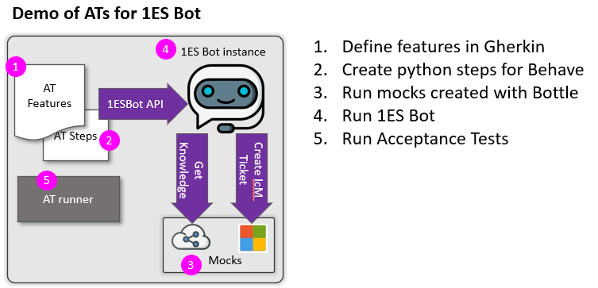

# Demo of AT for the API web service

Demonstrating AT for API web service




## Pre-requisites

```
pip install -r requirements.txt`
```


## How to run

```
.\ats_up.ps1
.\ats_run.ps1
.\ats_down.ps1
```


## Reference

 - [Gherkin](https://cucumber.io/docs/gherkin/)
 - [Behave](https://behave.readthedocs.io/en/latest/)